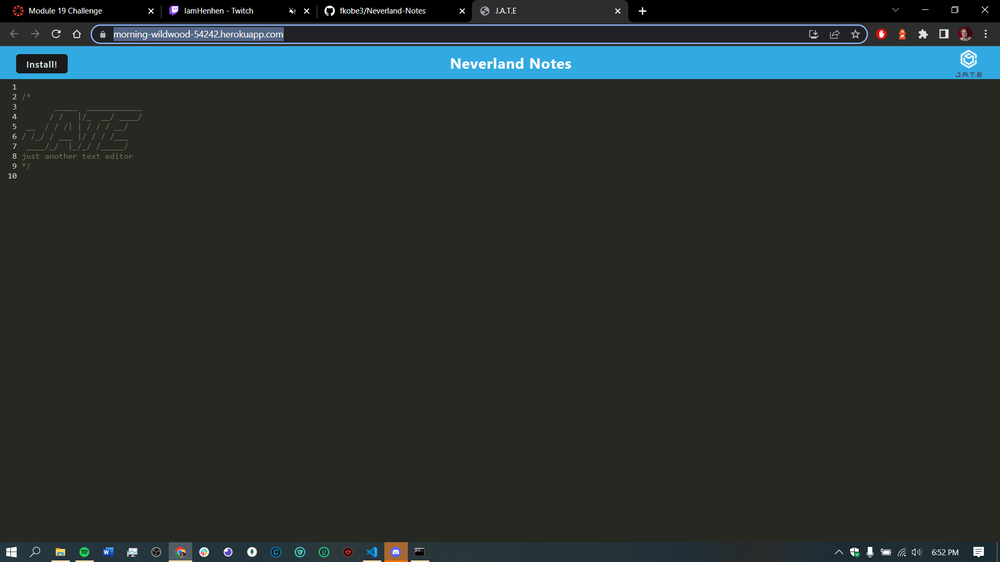
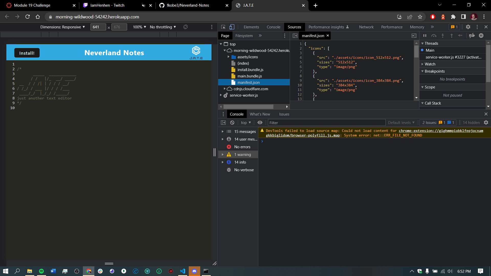

# Neverland-Notes

## Module 19 HW | Progressive Web Applications (PWA) Challenge: Text Editor

✩ [Description](#description)
✩ [Mock Up](#mock-up)
✩ [Github Repository](#github-repository)
✩ [Heroku Deployment](#heroku-deployment)
✩ [Gitignore](#gitignore-details)

## Description

    Neverland Notes allows you to switch between online and offline modes and still works, whether you are in your home or all the way in Neverland. It
    also allows you to download the app to your desktop from the web browser itself.

## Mock Up

Application Functionality:

## Github Repository

https://github.com/fkobe3/Neverland-Notes And 

https://fkobe3.github.io/Neverland-Notes/
## Heroku Deployment

https://morning-wildwood-54242.herokuapp.com/